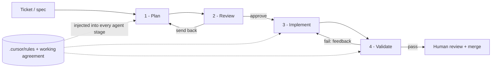
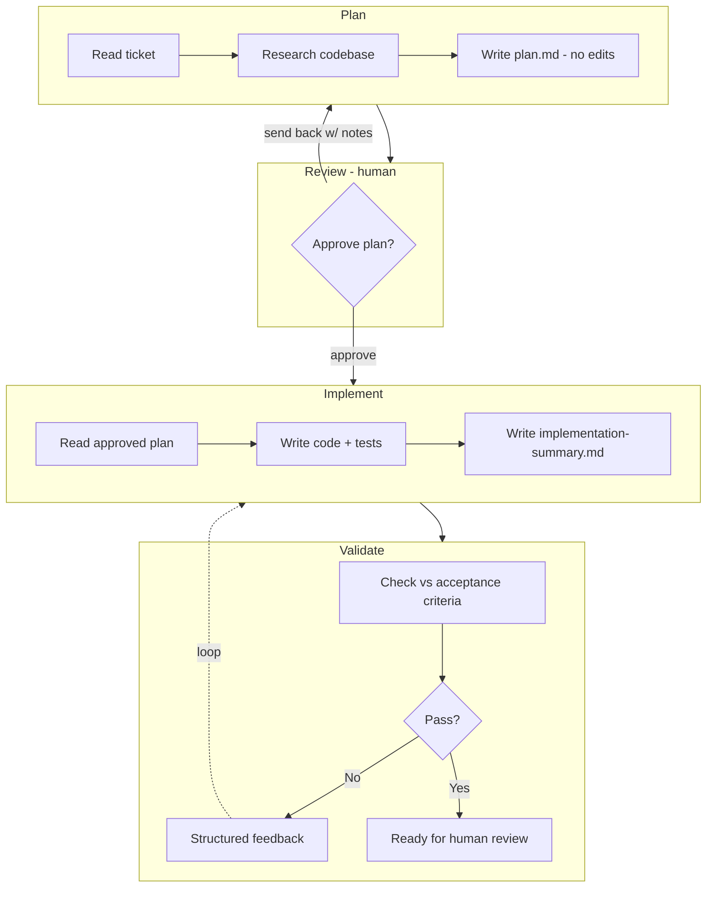
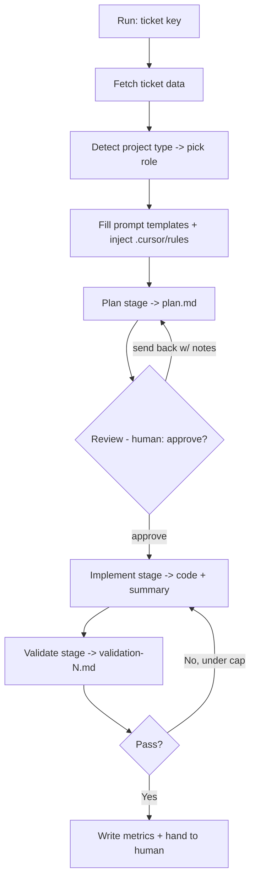

# Plan → Review → Implement → Validate: An Agentic Coding Workflow with Cursor

A writeup of how I used AI coding agents as a real engineering practice on a large production .NET/React codebase — not as autocomplete, and not as a magic box you trust. It's sanitized: no employer, no product names, no internal code. It's about the *workflow* and the *judgment posture*, both of which transfer to any codebase.

The short version: an AI agent that's allowed to do whatever it wants produces confident, plausible, and architecturally wrong code at scale. The value is in the scaffolding around it — staged execution, conventions encoded as rules, and a validation step whose whole job is to distrust the previous step.

**This repo isn't only prose.** It includes the real (sanitized) artifacts that make the workflow work:

- [`prompts/`](prompts/) — the templates for the three *agent* stages ([plan](prompts/plan-prompt.txt), [implement](prompts/implement-prompt.txt), [validate](prompts/validate-prompt.txt)) and the per-stack [role files](prompts/roles), exactly as the pipeline consumes them. (Review is a human step, so it has no prompt.)
- [`scripts/run_agent.py`](scripts/run_agent.py) — a readable, dependency-free distillation of the orchestrator that ties the stages together (role selection, prompt templating, `.cursor/rules` injection, the Review approval gate with send-back-to-plan, the implement↔validate loop, and metrics).

## Table of contents

1. [Why a workflow, not just a chat window](#1-why-a-workflow-not-just-a-chat-window)
2. [The four stages](#2-the-four-stages)
3. [`.cursor/rules`: conventions the agent must obey](#3-cursorrules-conventions-the-agent-must-obey)
4. [The orchestration](#4-the-orchestration)
5. [Verify, don't trust: the validation posture](#5-verify-dont-trust-the-validation-posture)
6. [Where AI genuinely accelerated the work](#6-where-ai-genuinely-accelerated-the-work)
7. [Where it misled — and how the workflow caught it](#7-where-it-misled--and-how-the-workflow-caught-it)
8. [My judgment posture on AI tooling](#8-my-judgment-posture-on-ai-tooling)
9. [Running the reference orchestrator](#9-running-the-reference-orchestrator)

---

## 1. Why a workflow, not just a chat window

Most people use an AI coding tool as a faster Stack Overflow: ask, paste, tweak. That's fine for a snippet. It falls apart on a real ticket in a real codebase, for three reasons:

- **No shared context between tasks.** Every new chat starts cold. The agent re-derives (or re-guesses) how *this* codebase does CQRS, error handling, mapping, and testing — and guesses inconsistently.
- **Confidence is uncorrelated with correctness.** A model will produce clean, well-commented, fully-tested code that quietly violates an architectural boundary. Tests passing tells you it *runs*, not that it's *right*.
- **One pass conflates planning, building, and checking.** When the same uninterrupted generation decides the approach, writes the code, and declares victory, there's no independent point where a mistake can be caught.

The workflow fixes all three: conventions are written down once and injected every time, the work is split into stages with different goals, and the last stage's only job is to find what the earlier stages got wrong.



---

## 2. The four stages

Three of the four stages are separate agent invocations, each with a distinct role, prompt, and success condition. The fourth — **Review** — is a human gate between planning and building. Splitting the work this way is the whole point: it creates seams where a human, or the next stage, can intervene *before* effort is spent going the wrong direction.

**Stage 1 — Plan.** The agent reads the ticket and researches the codebase *before writing any code*. Its output is a written implementation plan: which files change, which patterns apply, what the handlers/DTOs/migrations look like, what the tests should cover. No edits yet. The role here is "senior architect" ([`prompts/roles/plan-be.txt`](prompts/roles/plan-be.txt)), and the deliverable is a `plan.md` I can read in two minutes. Catching a wrong approach here costs a sentence; catching it after implementation costs a rewrite.

**Stage 2 — Review.** A human reads the plan and makes one decision: **approve** it, or **send it back** with notes. This is the highest-leverage point in the whole loop — steering the approach costs a sentence at plan time and a rewrite at implementation time. A send-back doesn't just abort; it re-runs Plan with the reviewer's notes fed in (the `{{REPLAN_CONTEXT}}` slot in the plan template), so the plan is revised and re-reviewed until it's right. Only an approved plan proceeds to code. The agent never goes from ticket to implementation unattended.

**Stage 3 — Implement.** A fresh agent takes the *approved* plan and executes it — writes the handlers, the validators, the mappers, the tests — following the plan and the codebase conventions, and it must get the build green before handing off. Its output is the code change plus an `implementation-summary.md` describing what it actually did (which often diverges from the plan in small ways worth noting).

**Stage 4 — Validate.** A *different* agent reviews the implementation against the acceptance criteria and the codebase rules. Crucially it's adversarial by design ([`prompts/validate-prompt.txt`](prompts/validate-prompt.txt) opens with "You must NOT modify any code" and drives a fixed report format): its job is not to confirm the work but to find what's wrong with it. If it finds problems, it writes structured feedback and the work loops back to Implement. If it passes, the change goes to a human for final review.



A real detail that mattered: **different stages used different models.** A fast, capable model did the implementation work where throughput matters; a stronger reasoning model did the validation, where catching a subtle architectural violation is worth the extra time and cost. Matching model strength to the cognitive demand of the stage — rather than using one model for everything — measurably improved the catch rate without blowing up cost or latency.

---

## 3. `.cursor/rules`: conventions the agent must obey

This is the layer that turns a generic model into one that writes code indistinguishable from the team's. The conventions live as rule files in `.cursor/rules/` — version-controlled, reviewed like any other code, and injected into every stage automatically (see `read_cursor_rules` in [`scripts/run_agent.py`](scripts/run_agent.py)). Instead of re-explaining the house style in every prompt, you write it once.

The rules cover exactly the things a new engineer would get wrong on day one:

- **CQRS structure** — one handler per use case; primary-constructor injection with null-guarded dependencies; `Result<T>` for outcomes, never thrown exceptions for expected failures.
- **Data access boundaries** — *no raw SQL in handlers, ever*; all SQL lives behind repository methods; reads use `asNoTracking`; cancellation tokens flow through every async call.
- **Mapping** — one mapping approach only (a source-generated mapper); hand-rolled entity-to-DTO mapping inside a handler is a rejection.
- **Error handling and logging** — typed `Error.Create(ErrorType.X, ...)`; structured logging; never log secrets or PII.
- **Testing** — what to cover (happy path plus boundary and failure cases), and that tests must be deterministic.
- **File organization** — one class per file, organized by feature then type, names matching exactly.

A representative rule, paraphrased from the real ones:

> **NEVER use raw SQL operations in command/query handlers.** All SQL — including `ExecuteSqlRawAsync`, stored procedures, and dynamic queries — must be implemented in repository methods. The application layer only calls repository methods. Use parameterized queries for everything.

That single rule, enforced on every generation, eliminated an entire class of layer-boundary violations that a model will otherwise happily produce, because in isolation "just run the SQL in the handler" looks like the simplest correct thing.

On top of the IDE rules sits a **working agreement** — a root `CLAUDE.md`-style file that defines the *review* standard, not just the code style. Its non-negotiables became the backbone of the validation stage:

> 1. **Verify every claim against the source.** Never repeat what a README, comment, or commit message *says* about the code without confirming it in the actual files.
> 2. **Cite evidence for every finding** — name the file and line.
> 3. **Separate "it works / it's tested" from "it's well-structured."** Code can be fully tested and still violate boundaries.
> 4. **Always run a red-team pass:** *"What would a strict senior reviewer reject this for?"* Never end on "looks good" without it.
> 5. **State what you could NOT verify.**

---

## 4. The orchestration

The four stages are wired together by a small orchestrator so a whole ticket runs as one command. The plumbing is what makes the workflow repeatable instead of a thing one person does by hand. A readable, dependency-free version is in this repo at [`scripts/run_agent.py`](scripts/run_agent.py); the production original additionally integrated the issue tracker, ran stages in cloud containers, and published branches — omitted here so the workflow itself stays legible.

What it handles:

- **Ticket ingestion.** Pull the ticket from the issue tracker, save its data locally, and feed it into the Plan stage as context.
- **Prompt templating.** The three prompts in [`prompts/`](prompts/) are the source of truth, with `{{PLACEHOLDER}}` tokens substituted at runtime — the ticket key, the plan path, the previous validation feedback, the iteration number, and an auto-detected block of the repo's `.cursor/rules`.
- **Role selection.** It auto-detects project type from the repo (a `.sln`/`.csproj` at the root means backend; a `package.json` means frontend) and loads the matching [role persona](prompts/roles) — "senior backend architect" for planning a .NET service, "senior frontend engineer" for implementing React, and so on.
- **The Review gate.** After Plan, the orchestrator pauses and presents `plan.md`. A human approves it or sends it back with notes; a send-back re-runs Plan with those notes injected via `{{REPLAN_CONTEXT}}`. Nothing is implemented until a plan is approved.
- **The iteration loop.** Implement → Validate, carrying the previous feedback forward, until the validator writes `OVERALL VERDICT: PASS` or a cap is hit.
- **Artifacts and metrics for every run.** Each run produces a `plan.md`, an `implementation-summary.md`, one `validation-N.md` per round, a per-stage `metrics.json` (wall-clock, files touched, LOC delta), and a `run-summary.json` aggregating those totals plus verdict (`PASS`, `FAIL_AFTER_MAX_ITERATIONS`, `PLAN_FAILED`, `ABORTED_AT_REVIEW`, etc.), iterations-until-pass, and `.cursor/rules/` bytes injected. That last part matters more than it sounds: it turns "AI is helping, I think" into measured data about where time and code delta actually went — and gives you concrete numbers to write about the workflow later.



That approval gate *is* the **Review** stage, and it's deliberately human. The agent never went from ticket to merged code unattended: it went from ticket, to a *plan a human signed off on* (or sent back for revision), to code a validator checked, to a human's final review before merge.

---

## 5. Verify, don't trust: the validation posture

The validation stage is the part I'd defend hardest, because it's where most "AI coding" setups are weakest. A validator that asks "does this look right?" will almost always say yes — models are agreeable. So the validation stage was built to be **structurally adversarial**, running a fixed checklist top to bottom, architecture first:

1. **Architecture and boundaries — first, never skipped.** Map every changed file to its real layer (Domain / Application / Infrastructure / Presentation). Flag anything in the wrong project — a concrete adapter in Domain, orchestration in Core, raw SQL in a handler. Verify dependency direction by actually opening the project files, not by trusting a doc.
2. **Correctness** against each explicit acceptance criterion, checked one by one.
3. **Testing** — do the tests cover boundary and failure cases, or just the happy path? Are they deterministic?
4. **Security** — parameterized queries, no secrets in logs, least privilege.
5. **A mandatory red-team pass** — *"what would a strict senior reviewer reject this for?"* — plus an explicit list of what could not be verified in the environment.

The output separates verdicts — **correctness, testing, architecture** — so a strong score on two can't hide a weak score on the third. That last bit is the crux: the most dangerous AI-generated PR is one that works and is fully tested and is structurally wrong, because it sails through any review that conflates those axes.

---

## 6. Where AI genuinely accelerated the work

Being concrete and honest about the wins:

- **Mechanical, pattern-following code.** A new query handler that's the fifth variation of a shape the codebase already has — the agent produces it in seconds, correctly, including the test, because the pattern is in the rules. This is the bulk of CRUD-adjacent feature work and AI is genuinely fast at it.
- **Test scaffolding.** Generating the happy-path-plus-edge-cases test skeleton from a handler, in the team's testing conventions, was a consistent time saver. I'd then sharpen the assertions.
- **Codebase research during planning.** "Where is X handled, what's the existing pattern for Y" — the Plan stage navigating a large unfamiliar area and summarizing the relevant pieces was faster than grepping by hand, *as long as I verified its summary against the files.*
- **Migrations and boilerplate-heavy artifacts.** Repetitive, schema-shaped work where the rules pin down the format.
- **First-draft documentation** from a diff or a summary — a starting point to edit, never the final word.

## 7. Where it misled — and how the workflow caught it

Equally concrete about the failures, because pretending they don't exist is how you ship bad code fast:

- **Confident architectural violations.** The classic: SQL inlined in a handler because it's "simpler." It runs, it's testable, it's wrong. The `.cursor/rules` prevented most of these at generation time; the architecture-first validation pass caught the rest. Neither a human skim nor a "does it pass tests" check would have.
- **Plausible-but-fabricated specifics.** Referencing a helper, a config key, or a method that doesn't exist in this codebase — stated with total confidence. The "verify every claim against the source" rule exists precisely for this; the validator is required to open the file and prove the reference, not trust it.
- **Tests that assert the bug.** When the agent both writes the code and writes its tests, the tests sometimes encode the wrong behavior and pass. Independent validation against the *acceptance criteria* (not against the code) is what catches this.
- **Over-engineering.** Reaching for extra abstraction layers a small ticket didn't need. Right-sizing was an explicit rule, and the validator flagged gold-plating as a finding.
- **"Looks good" with no red-team.** Left alone, a model concludes positively. Making the red-team pass *mandatory before any verdict* was the single highest-leverage rule in the whole setup.

The throughline: **every failure mode was caught by a structural check, not by hoping the model would be careful.** That's the difference between using AI and being used by it.

## 8. My judgment posture on AI tooling

Where I've landed, after running this at scale on production code:

- **AI is a force multiplier on a senior engineer, and a risk multiplier on everyone else.** It accelerates someone who can tell right from plausible. It accelerates *mistakes* for someone who can't. The skill that matters more than ever is the review judgment to know the difference — which is exactly the skill this workflow tries to encode and enforce.
- **The leverage is in the scaffolding, not the model.** Swap the model and the workflow still works. Remove the staged structure, the conventions-as-rules, and the adversarial validation, and the best model on the market will still ship you confident garbage at speed. The engineering is in the harness.
- **"It runs and it's tested" is not "it's correct."** I treat AI output the way I treat a strong but unfamiliar contributor's PR: assume good faith, verify everything, and never let test coverage substitute for an architecture review.
- **Keep a human at the gate.** The agent plans and proposes; a human approves the plan and owns the merge. I'd automate aggressively up to that line and not across it.
- **Measure it.** The per-run metrics turned vibes into data — where time actually went, which stage caught what. If you can't measure whether the AI workflow is helping, you're trusting a feeling, and feelings about AI productivity are unreliable in both directions.

The headline I'd put on all of it: AI didn't replace engineering judgment in this work — it raised the premium on it. The workflow exists to put that judgment where it counts and to stop the tool from quietly routing around it.

---

## 9. Running the reference orchestrator

The orchestrator is intentionally **agent-agnostic** — it doesn't hard-code any vendor's CLI. You supply one via `--agent-cmd`, a template where `{prompt_file}` and `{repo}` are substituted. The agent is expected to read the rendered prompt, edit files in the target repo, and write the artifact each stage names (`plan.md`, the summary, the validation report).

```bash
python scripts/run_agent.py ABC-123 \
    --repo /path/to/target/repo \
    --agent-cmd "cursor-agent --cwd {repo} --prompt-file {prompt_file}"
```

Flow: it detects the project type and whether the repo is greenfield, then runs **Plan**. The **Review** gate pauses for you to approve `output/ABC-123/plan.md` or send it back with notes (which re-runs Plan with your notes injected). Once a plan is approved, it loops **Implement → Validate** (carrying feedback forward) until the validator writes `OVERALL VERDICT: PASS` or `--max-iterations` is reached. Per-stage metrics (wall-clock, files touched, LOC delta) land in `output/ABC-123/metrics.json`; an aggregated `run-summary.json` is written at every exit point (PASS, FAIL, stage failure, or human abort) with totals + verdict + iterations-until-pass + `.cursor/rules/` size.

It needs no third-party Python packages — only whatever agent CLI you point it at. This is a distilled reference, not the production system: it deliberately omits issue-tracker integration, cloud execution, and automated branch publishing so the workflow itself is easy to read and adapt.

---

## 10. Case study: running it against a real greenfield build

The workflow above was originally shaped against a large existing codebase. To pressure-test it against a different context, I ran it against a **greenfield** build — a fresh .NET 9 service (webhook ingest + REST query API + Basic Auth + three test tiers), spec-only framing, no existing code to reference. In parallel I built the same brief manually with the "product-first, not time-boxed PoC" framing, so I could compare what the two approaches produce against identical requirements.

Full retrospective — what worked, what didn't, gaps discovered, and prioritized improvements — lives in [`RETROSPECTIVE_greenfield_backend_run.md`](RETROSPECTIVE_greenfield_backend_run.md). Sanitized: no client, no product names.

Short version of what the exercise surfaced:

- **`.cursor/rules/` was the leverage point.** A hand-written 13-rule `no-speculation.md` in the target repo pulled the agent back to minimal on every iteration where the default plan drifted toward enterprise ceremony. Per-repo explicit rules outperformed per-workflow implicit persona prompts.
- **The role files needed refactoring.** The original `plan-be.txt` / `implement-be.txt` prescribed a specific enterprise stack (MediatR, GraphQL, JWT) as the .NET default — that biased every greenfield build regardless of ticket scope. Refactored to persona + right-sizing mindset only; tech-stack context moved to a per-repo file. Documented as a pattern in [`prompts/README.md`](prompts/README.md).
- **The orchestrator had a Windows-compat bug.** `subprocess.run(shlex.split(cmd))` used POSIX-mode shlex, stripping backslashes from Windows paths. Fixed with `posix=(os.name != "nt")` in `run_agent.py`.
- **Greenfield mode surfaced as an artifact.** [`templates/tech-stack.default.md`](templates/tech-stack.default.md) is an opt-in bootstrap template for new .NET services — sensible package defaults + an explicit "these are built into the framework, don't add a package" section + an explicit "NOT in these defaults" section that applies the same discipline as `.cursor/rules/no-speculation.md`, one layer up.
- **Adversarial review has diminishing returns.** Five review passes against the parallel manual build. Each round found things, but by round 5 the findings were nits + doc-drift the earlier fix rounds had surfaced. Round 5's own advice: "the core is the right shape; more polish will feed the complexity objection." That was the signal to stop iterating and start defending — the workflow could bake a "review-done" heuristic in a future iteration.

The exercise also produced improvements to this repo — the retrospective's table lists them ranked P0-P3. The important meta-lesson: running the workflow against a real build in a different context surfaced things the abstract description would never have. Dogfooding is not optional for a portfolio piece; it's the only honest way to know whether the workflow works in more than the one context it was born in.

---

*Part of my [engineering portfolio](https://github.com/dlastorta). Companion writeup: [modular-monolith-patterns](https://github.com/dlastorta/modular-monolith-patterns). Contact: dlastorta@gmail.com · [linkedin.com/in/diegolastorta](https://linkedin.com/in/diegolastorta)*
