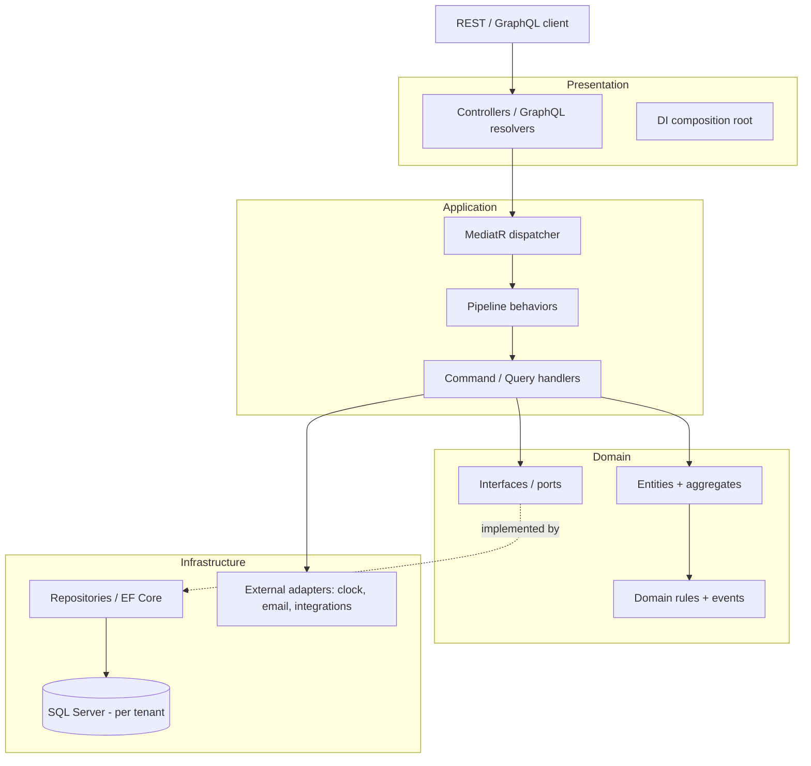
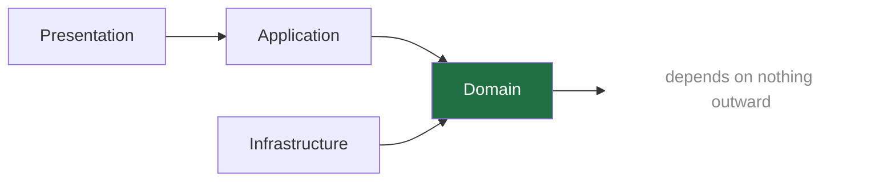
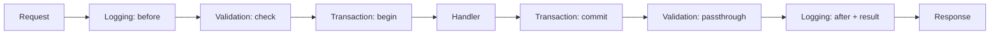
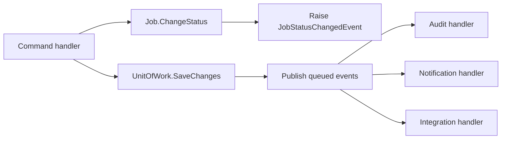
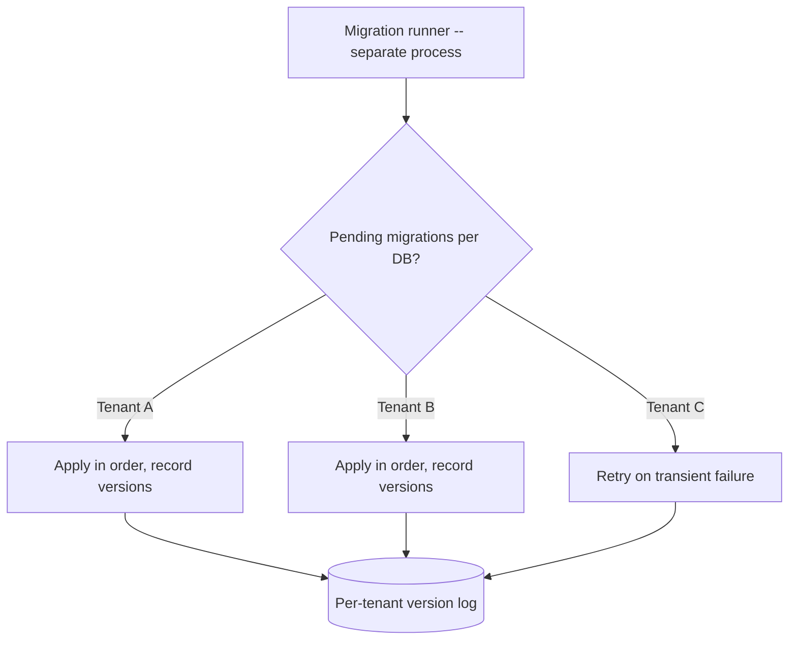

# Modular Monolith with Clean Architecture, CQRS, and MediatR Pipeline Behaviors

A writeup of the backend architecture I worked in for two years on a large platform rebuild — a multi-tenant SaaS replacing a 15-year-old desktop ERP. It's written as **patterns, not a product**: everything here is sanitized, with no employer, no internal code, and no business-specific detail. The entities (`Job`, `CrewRole`) are generic stand-ins to make the examples concrete.

The point is to show how a team keeps a single deployable backend maintainable as it grows — and how cross-cutting concerns stop being copy-pasted into every handler and become composable infrastructure instead.

> **This repository is a runnable reference implementation, not just an essay.** The patterns below are backed by a small but complete .NET solution you can clone, build, test, and run. See [Running it](#running-it) for commands and [The reference implementation](#the-reference-implementation) for the layout.

## Table of contents

1. [Context: why a modular monolith](#1-context-why-a-modular-monolith)
2. [Architecture overview](#2-architecture-overview)
3. [The layers and the dependency rule](#3-the-layers-and-the-dependency-rule)
4. [CQRS: commands and queries as first-class objects](#4-cqrs-commands-and-queries-as-first-class-objects)
5. [Pipeline behaviors as decoration](#5-pipeline-behaviors-as-decoration)
6. [Errors as values: the Result<T> pattern](#6-errors-as-values-the-resultt-pattern)
7. [Domain events instead of database triggers](#7-domain-events-instead-of-database-triggers)
8. [Multi-tenancy and the migration runner](#8-multi-tenancy-and-the-migration-runner)
9. [What worked](#9-what-worked)
10. [What I'd do differently](#10-what-id-do-differently)
11. [The reference implementation](#the-reference-implementation)
12. [Running it](#running-it)

---

## 1. Context: why a modular monolith

The system replaced a 15-year-old Windows Forms ERP. The legacy app couldn't model the business's core primitive — multi-day, multi-resource jobs — so it was rebuilt from scratch as a multi-tenant SaaS on .NET 10 with a React front end.

The architecture question early on is always the same: **microservices or monolith?** For this team, at this stage, a **modular monolith** was the right answer, and I'd make the same call again:

- **One business domain, tightly related modules.** Jobs, scheduling, dispatch, tickets, billing — these share data and invariants constantly. Splitting them into services would have meant distributed transactions and chatty cross-service calls to enforce rules that are trivial in-process.
- **A small team can't afford the operational tax of microservices.** Independent deploys, network failure modes, distributed tracing, schema-per-service versioning — that's a lot of overhead to pay before you have the scale that justifies it.
- **Modularity is an architectural property, not a deployment one.** You get most of the benefit people want from microservices — clear boundaries, independent reasoning, testability — from disciplined module and layer boundaries inside one deployable. You can always extract a module into a service later *if* a real scaling or team-autonomy reason appears. Going the other way (merging services back) is much harder.

So: **one deployable, hard internal boundaries.** The discipline that makes that work is Clean Architecture for the layering and CQRS for the module-internal structure.

---

## 2. Architecture overview

At a high level, a request flows from the API surface, through an application-layer handler selected by a mediator, into the domain and out to infrastructure — never the other way around.



The thing to notice: the **Application layer depends on Domain interfaces (ports)**, and **Infrastructure implements those interfaces**. The arrow from `Ports` to `Repos` is dashed and points *out* only at composition time — the dependency direction in code points *inward*.

---

## 3. The layers and the dependency rule

Four layers, with one non-negotiable rule: **dependencies point inward.** `Presentation → Application → Domain`, and `Infrastructure → Domain`. The Domain depends on nothing outward.

| Layer | Holds | Must NOT contain |
|-------|-------|------------------|
| **Domain** | Entities, value objects, domain rules, domain events, and the **interfaces (ports)** the outer layers implement | Framework SDKs, ORM types, HTTP, UI, concrete I/O |
| **Application** | Use cases as command/query handlers, orchestration, validation, mapping, DTOs | Direct SQL, HTTP calls, file I/O, UI concerns |
| **Infrastructure** | Concrete adapters: EF Core repositories, the system clock, email, external integrations | Business rules |
| **Presentation** | REST controllers, GraphQL resolvers, and the DI composition root | Business rules |



Why this matters in practice: the Domain — the part that encodes what the business actually *is* — can be tested with no database, no web host, and no mocking framework gymnastics. And when you swap an adapter (a new email provider, a different external integration), the change is contained in Infrastructure. Nothing in the business logic moves.

The trap to avoid is the **catch-all "Common" or "Core" project** that ends up holding entities *and* concrete services *and* DTOs *and* a reference to some UI or ORM package. It looks tidy because every class inside it is clean, but the boundary has failed: the domain now transitively depends on infrastructure. The check I run on any Clean Architecture codebase is to open each project file and confirm the Domain project references **nothing** outward — no ORM, no web framework, no transport client. "Platform-agnostic" does not excuse a presentation or infrastructure package living in the domain.

---

## 4. CQRS: commands and queries as first-class objects

Inside the Application layer, every use case is a **command** (it changes state) or a **query** (it reads state), dispatched through MediatR. There's no fat "service" class with twelve methods; there's one handler per use case, each doing exactly one thing.

A query handler, sanitized to a generic `CrewRole` entity:

```csharp
public class GetCrewRoleByIdQueryHandler(
    IUnitOfWork unitOfWork,
    ILogger<GetCrewRoleByIdQueryHandler> logger,
    IMapper mapper)
    : IRequestHandler<GetCrewRoleByIdQuery, Result<CrewRoleDto>>
{
    public async Task<Result<CrewRoleDto>> Handle(
        GetCrewRoleByIdQuery request, CancellationToken cancellationToken)
    {
        var entity = await unitOfWork.CrewRoleRepository.GetByIdAsync(
            request.RoleId, asNoTracking: true, cancellationToken);

        if (entity is null)
        {
            logger.LogWarning("CrewRole {RoleId} not found", request.RoleId);
            return Result<CrewRoleDto>.Failure(
                Error.Create(ErrorType.NotFound, ErrorMessages.CrewRoleNotFound));
        }

        return Result<CrewRoleDto>.Success(mapper.Map<CrewRoleDto>(entity));
    }
}
```

A few senior-level conventions are visible here, and they were enforced consistently across hundreds of handlers:

- **One responsibility per handler.** `GetCrewRoleByIdQueryHandler` does one readable thing. This is the Single Responsibility Principle in its most literal, useful form — every handler has exactly one reason to change.
- **Reads use `asNoTracking`.** Queries never need EF Core's change tracker, so turning it off avoids the snapshot overhead on read paths.
- **No raw SQL in handlers.** All data access — including any hand-tuned SQL or stored-procedure calls — lives behind repository methods. The Application layer calls repositories; it never touches the database directly. That keeps the layer boundary honest and the handlers unit-testable.
- **Mapping is centralized.** Entity-to-DTO mapping goes through AutoMapper profiles, never hand-rolled inside handlers, so the shape of an API contract changes in one place.
- **Not-found is a result, not an exception.** More on that in [§6](#6-errors-as-values-the-resultt-pattern).

The win of CQRS here isn't theoretical purity. It's that the codebase becomes **navigable**: a new engineer (or an AI agent) looking for "what happens when a crew role is created" goes straight to `CreateCrewRoleCommandHandler` and reads one self-contained file. There's no spelunking through a 900-line service.

---

## 5. Pipeline behaviors as decoration

This is the pattern I'd most want a senior reviewer to see, because it's where the architecture pays off.

Every handler needs the same cross-cutting things: log the request, validate it, run it in a transaction. The naive approach copies that boilerplate into every handler. The right approach lifts it out into **MediatR pipeline behaviors** — each one a decorator that wraps the handler with the same interface.

You register them as open generics, and **order is the execution order**:

```csharp
services.AddScoped(typeof(IPipelineBehavior<,>), typeof(LoggingBehaviour<,>));
services.AddScoped(typeof(IPipelineBehavior<,>), typeof(ValidationBehaviour<,>));
services.AddScoped(typeof(IPipelineBehavior<,>), typeof(TransactionScopeBehavior<,>));
```

Every command and query is now wrapped, outermost-first, like layers of an onion:



The validation behavior, sanitized — note how it **short-circuits**: if validation fails, the handler never runs.

```csharp
public class ValidationBehaviour<TRequest, TResponse>(
    IEnumerable<IValidator<TRequest>> validators)
    : IPipelineBehavior<TRequest, TResponse>
    where TRequest : IRequest<TResponse>
{
    public async Task<TResponse> Handle(
        TRequest request,
        RequestHandlerDelegate<TResponse> next,
        CancellationToken ct)
    {
        if (!validators.Any()) return await next(ct);

        var context = new ValidationContext<TRequest>(request);
        var results = await Task.WhenAll(
            validators.Select(v => v.ValidateAsync(context, ct)));
        var failures = results.SelectMany(r => r.Errors)
                              .Where(f => f is not null)
                              .ToList();

        if (failures.Count == 0)
            return await next(ct);  // valid -> continue down the pipeline

        // invalid -> short-circuit with a typed failure, handler never runs
        var error = Error.Create(ErrorType.InvalidInput, failures);
        return Result.AsFailure<TResponse>(error);
    }
}
```

And the logging behavior, which runs on the way in *and* the way out, and is careful never to log sensitive fields:

```csharp
public class LoggingBehaviour<TRequest, TResponse>(
    ILogger<LoggingBehaviour<TRequest, TResponse>> logger)
    : IPipelineBehavior<TRequest, TResponse>
    where TRequest : IRequest<TResponse>
{
    public async Task<TResponse> Handle(
        TRequest request,
        RequestHandlerDelegate<TResponse> next,
        CancellationToken ct)
    {
        logger.LogInformation("Handling {Request}", typeof(TRequest).Name);
        LogNonSensitiveProperties(request);   // skips Password, tokens, PII

        var response = await next(ct);         // runs the rest of the pipeline

        if (response is IResult { IsSuccess: false } result)
            logger.LogWarning("{Request} failed: {Error}",
                typeof(TRequest).Name, result.Error.Message);

        return response;
    }
}
```

Why this design is worth pointing at:

| Pattern / principle | How it shows up |
|---|---|
| **Decorator** | Each behavior wraps the handler behind the same interface, adding behavior without changing it |
| **Chain of Responsibility** | The `next` delegate forms the chain; any behavior can short-circuit it (validation does) |
| **Open/Closed Principle** | A new cross-cutting concern is a new behavior class plus one registration line. No handler changes. |
| **DRY, done right** | Logging, validation, and transactions exist exactly once, not scattered across hundreds of handlers |

The one-sentence version I'd give in a review: *the pipeline is the Decorator pattern applied to cross-cutting concerns — adding a concern means adding a class and registering it; handlers and other behaviors don't move.* That's the Open/Closed Principle as an actual day-to-day workflow rather than a slogan.

---

## 6. Errors as values: the Result<T> pattern

Handlers return `Result<T>` rather than throwing for expected failures. A "crew role not found" or "this name is already taken" is a normal business outcome, not an exceptional one — so it travels back as data, not as a thrown exception unwinding the stack.

```csharp
public class Result<T>
{
    public bool IsSuccess { get; }
    public T? Value { get; }
    public Error? Error { get; }

    public static Result<T> Success(T value) => new(true, value, null);
    public static Result<T> Failure(Error error) => new(false, default, error);
}
```

This pairs naturally with the pipeline. The validation behavior can manufacture a `Result.Failure` and short-circuit without ever throwing; the presentation layer maps `Error.ErrorType` (`NotFound`, `InvalidInput`, `Conflict`, ...) to the right HTTP status or GraphQL error. Exceptions stay reserved for genuinely unexpected conditions — the ones you *do* want to fault the request and alert on.

The benefit is honesty in the type signature. A method returning `Result<CrewRoleDto>` tells the caller, at compile time, that it can fail and that failure must be handled. A method that returns `CrewRoleDto` and throws hides that contract in documentation nobody reads.

---

## 7. Domain events instead of database triggers

The legacy system leaned on SQL triggers for cross-cutting side effects — audit rows, derived updates. Triggers are *action at a distance*: invisible from the application, hard to test, and they surface errors down at the database layer where they're painful to trace.

In the rebuild, those concerns moved into the application as **domain events published through MediatR notifications**. An aggregate raises an event when its state changes; after the unit of work saves, the events are dispatched to any number of `INotificationHandler<T>` implementations.

```csharp
public abstract class AggregateRoot
{
    private readonly List<INotification> _events = new();
    public IReadOnlyList<INotification> DomainEvents => _events;
    protected void Raise(INotification e) => _events.Add(e);
    public void ClearDomainEvents() => _events.Clear();
}

public class Job : AggregateRoot
{
    public void ChangeStatus(string newStatus)
    {
        Status = newStatus;
        Raise(new JobStatusChangedEvent(Id, newStatus));
    }
}
```



The same behavior as triggers, but now it's **visible in code, unit-testable, version-controlled, and database-agnostic.** When a workflow needs cross-service or cross-process consistency, the next step up is the **outbox pattern** — write the event to an outbox table in the same transaction as the business change, and let a separate dispatcher deliver it — which buys you reliable delivery without distributed transactions. Reach for that only when you actually have a consistency boundary that demands it.

---

## 8. Multi-tenancy and the migration runner

Each tenant got its own database. That's the stronger end of the isolation spectrum (versus a shared schema with a tenant-id column and a global query filter): cleaner blast radius, per-tenant backup and restore, and no risk of a missing filter leaking one tenant's data into another's query. The cost is operational — schema changes now have to be applied across *many* databases, reliably.

So migrations were not run on app startup. In a multi-instance container deployment that's a race: two instances boot and both try to migrate. Instead, schema evolution was handled by a dedicated **migration runner** — a separate process that:

- applies versioned migrations (hundreds of them, plus embedded SQL scripts) across all tenant databases in **parallel batches**;
- keeps a **per-database record** of which migrations have been applied, so each run is idempotent;
- isolates failures **per tenant** — one tenant's bad state doesn't abort the whole fleet;
- supports **retry and rollback** so a transient failure mid-fleet is recoverable.



The principle worth carrying to any multi-tenant system: **make schema rollout an explicit, observable, restartable operation** — never an implicit side effect of an app process starting up.

---

## 9. What worked

- **The modular monolith was the right call.** Hard internal boundaries gave us most of what teams chase microservices for — independent reasoning, testability, clear ownership — without the distributed-systems tax a small team can't carry. Nothing about it would block extracting a module into a service later if a real reason appeared.
- **Pipeline behaviors paid for themselves many times over.** Cross-cutting concerns lived in exactly one place. Adding request-level metrics, or tightening how validation failures were shaped, was a one-class change that instantly applied to every handler. That's the Open/Closed Principle delivering real leverage.
- **CQRS made the codebase legible.** One use case, one file, one responsibility. Onboarding was faster, code review was faster, and — not incidentally — AI coding agents navigated it well precisely because the structure was so regular (the subject of a [companion writeup](https://github.com/dlastorta/agentic-coding-workflow)).
- **`Result<T>` made failure explicit.** Expected failures stopped masquerading as exceptions. Control flow got easier to read and the type signatures stopped lying.
- **Moving triggers into domain events** turned invisible database magic into testable, reviewable application code.

## 10. What I'd do differently

- **Watch the "Common" project.** A shared project is convenient and quietly becomes a dumping ground — DTOs, enums, interfaces, the occasional helper — until it's a soft dependency magnet that blurs the boundaries the architecture is supposed to enforce. I'd be stricter earlier about what's allowed to live there, and split it before it grew.
- **Behavior order is load-bearing and should be documented as such.** Logging → Validation → Transaction is correct (you don't want to open a transaction for a request that's about to fail validation), but it's an invariant encoded only in registration order. I'd capture the *why* in a short architecture note next to the registration, because it's exactly the kind of thing a well-meaning change can silently break.
- **Introduce the outbox earlier for the genuinely cross-process events.** In-process domain events are great until a side effect has to reliably reach another system. Retrofitting the outbox after the fact is more work than designing the few events that need it that way from the start.
- **Guard the boundaries with a test, not just discipline.** Layer rules ("Domain references nothing outward") held because the team was disciplined, but discipline erodes. An architecture test asserting the dependency directions in CI makes the rule enforce itself and turns a code-review judgment call into a build failure. *This repo implements exactly that* — see [`LayerDependencyTests`](tests/ModularMonolith.ArchitectureTests/LayerDependencyTests.cs), which uses NetArchTest to fail the build if the Domain ever takes a dependency outward.

---

## The reference implementation

The repository backs every pattern above with a small, complete solution. It's deliberately tiny in surface area and strict in structure — the interesting part is the *shape*, not the feature count.

### Layout

```
src/
  ModularMonolith.Domain          // entities, aggregates, domain events, Result<T>, ports — ZERO dependencies
  ModularMonolith.Application     // CQRS handlers, validators, mapping, pipeline behaviors (MediatR, FluentValidation, AutoMapper)
  ModularMonolith.Infrastructure  // EF Core (SQLite), repositories, unit of work, domain-event dispatch, system clock
  ModularMonolith.WebApi          // minimal-API endpoints, Result -> HTTP mapping, DI composition root
tests/
  ModularMonolith.UnitTests          // domain logic, the validation behavior, and handlers (real DbContext on in-memory SQLite)
  ModularMonolith.ArchitectureTests  // NetArchTest assertions that enforce the dependency rules
```

Two modules — **Jobs** (the rich one: create, change status with a state machine, query) and **Catalog** (a minimal second module) — share the same layering and slices. That's the "modular" in modular monolith: features are isolated by module, not entangled in one big service.

### Design decisions worth calling out

A reviewer reading this repo's working agreement ([`CLAUDE.md`](CLAUDE.md) and [`CODE-REVIEW-CHECKLIST.md`](CODE-REVIEW-CHECKLIST.md)) will look for these, so they're explicit:

- **The Domain has zero outward dependencies — enforced, not just claimed.** Domain events are a Domain-owned `IDomainEvent` marker with no MediatR reference. The Application layer adapts them into MediatR notifications via `DomainEventNotification<T>`, and `LayerDependencyTests` fails the build if MediatR, EF Core, AutoMapper, or ASP.NET ever leak into Domain.
- **The unit of work hides EF Core.** `IUnitOfWork` (in Domain) exposes `SaveChangesAsync` and `ExecuteInTransactionAsync` — but no `DbContext` and no `IDbContextTransaction`. The transaction primitive stays in Infrastructure.
- **Transactions wrap commands only.** The `TransactionBehavior` checks an `ICommandBase` marker and skips queries — no point opening a transaction for a read.
- **Behavior order is load-bearing** and lives in one place: `AddApplication` registers Logging → Validation → Transaction, in that order, with a comment explaining why.
- **Database creation is `EnsureCreated` for demo convenience only.** The writeup's point about out-of-process migration runners (§8) is the real-world answer; a single-file SQLite `EnsureCreated` just keeps "clone and run" friction-free here.

## Running it

Requires the .NET SDK (the solution targets **.NET 8 LTS** for easy local runs; the production system it's modeled on ran on .NET 10).

```bash
# from the modular-monolith-patterns/ folder
dotnet build ModularMonolith.sln                 # compile everything
dotnet test  ModularMonolith.sln                 # run unit + architecture tests
dotnet run --project src/ModularMonolith.WebApi  # start the API (Swagger UI at the root)
```

Once the API is running, the endpoints are:

| Method | Route | What it does |
|---|---|---|
| `POST` | `/jobs` | Create a job (`{ "title": "..." }`) — returns 201, or 400 if the title is invalid |
| `GET` | `/jobs` | List all jobs |
| `GET` | `/jobs/{id}` | Get one job — 404 if missing |
| `PUT` | `/jobs/{id}/status` | Change status (`{ "newStatus": "Scheduled" }`) — 409 on an illegal transition |
| `GET` | `/crew-roles` | List the seeded Catalog reference data |

Creating a job and changing its status will log the domain-event handlers firing — the `INotificationHandler<DomainEventNotification<...>>` implementations reacting after the save.

---

*Part of my [engineering portfolio](https://github.com/dlastorta). Companion writeup: [agentic-coding-workflow](https://github.com/dlastorta/agentic-coding-workflow). Contact: dlastorta@gmail.com · [linkedin.com/in/diegolast